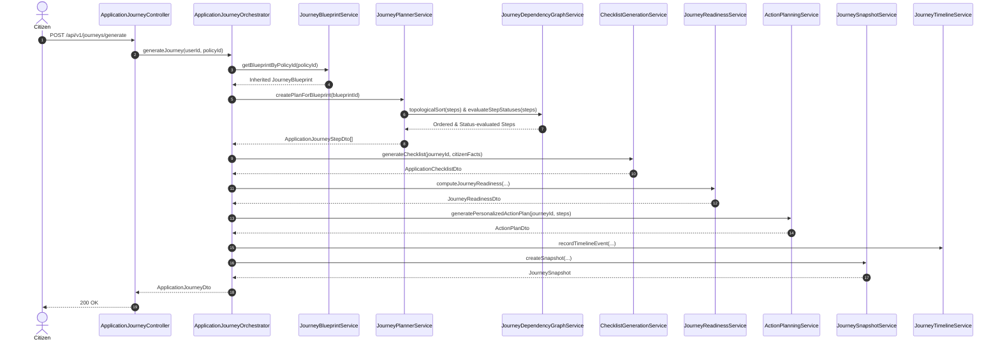

# Application Journey Generation Sequence Diagram

```mermaid
sequenceDiagram
    autonumber
    actor Citizen
    participant Controller as ApplicationJourneyController
    participant Orchestrator as ApplicationJourneyOrchestrator
    participant Blueprint as JourneyBlueprintService
    participant Planner as JourneyPlannerService
    participant Graph as JourneyDependencyGraphService
    participant Checklist as ChecklistGenerationService
    participant Readiness as JourneyReadinessService
    participant ActionPlan as ActionPlanningService
    participant Snapshot as JourneySnapshotService
    participant Timeline as JourneyTimelineService

    Citizen->>Controller: POST /api/v1/journeys/generate
    Controller->>Orchestrator: generateJourney(userId, policyId)
    Orchestrator->>Blueprint: getBlueprintByPolicyId(policyId)
    Blueprint-->>Orchestrator: Inherited JourneyBlueprint
    Orchestrator->>Planner: createPlanForBlueprint(blueprintId)
    Planner->>Graph: topologicalSort(steps) & evaluateStepStatuses(steps)
    Graph-->>Planner: Ordered & Status-evaluated Steps
    Planner-->>Orchestrator: ApplicationJourneyStepDto[]
    Orchestrator->>Checklist: generateChecklist(journeyId, citizenFacts)
    Checklist-->>Orchestrator: ApplicationChecklistDto
    Orchestrator->>Readiness: computeJourneyReadiness(...)
    Readiness-->>Orchestrator: JourneyReadinessDto
    Orchestrator->>ActionPlan: generatePersonalizedActionPlan(journeyId, steps)
    ActionPlan-->>Orchestrator: ActionPlanDto
    Orchestrator->>Timeline: recordTimelineEvent(...)
    Orchestrator->>Snapshot: createSnapshot(...)
    Snapshot-->>Orchestrator: JourneySnapshot
    Orchestrator-->>Controller: ApplicationJourneyDto
    Controller-->>Citizen: 200 OK
```
