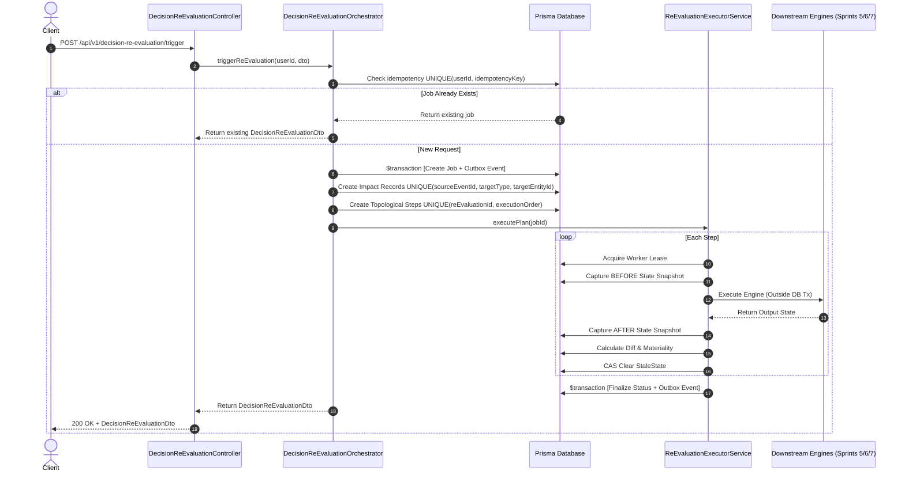

# Continuous Decision Re-evaluation Sequence Diagram

```mermaid
sequenceDiagram
    autonumber
    actor Client
    participant Controller as DecisionReEvaluationController
    participant Orchestrator as DecisionReEvaluationOrchestrator
    participant DB as Prisma Database
    participant Executor as ReEvaluationExecutorService
    participant Downstream as Downstream Engines (Sprints 5/6/7)

    Client->>Controller: POST /api/v1/decision-re-evaluation/trigger
    Controller->>Orchestrator: triggerReEvaluation(userId, dto)
    Orchestrator->>DB: Check idempotency UNIQUE(userId, idempotencyKey)
    alt Job Already Exists
        DB-->>Orchestrator: Return existing job
        Orchestrator-->>Controller: Return existing DecisionReEvaluationDto
    else New Request
        Orchestrator->>DB: $transaction [Create Job + Outbox Event]
        Orchestrator->>DB: Create Impact Records UNIQUE(sourceEventId, targetType, targetEntityId)
        Orchestrator->>DB: Create Topological Steps UNIQUE(reEvaluationId, executionOrder)
        Orchestrator->>Executor: executePlan(jobId)
        loop Each Step
            Executor->>DB: Acquire Worker Lease
            Executor->>DB: Capture BEFORE State Snapshot
            Executor->>Downstream: Execute Engine (Outside DB Tx)
            Downstream-->>Executor: Return Output State
            Executor->>DB: Capture AFTER State Snapshot
            Executor->>DB: Calculate Diff & Materiality
            Executor->>DB: CAS Clear StaleState
        end
        Executor->>DB: $transaction [Finalize Status + Outbox Event]
        Orchestrator-->>Controller: Return DecisionReEvaluationDto
        Controller-->>Client: 200 OK + DecisionReEvaluationDto
    end
```
