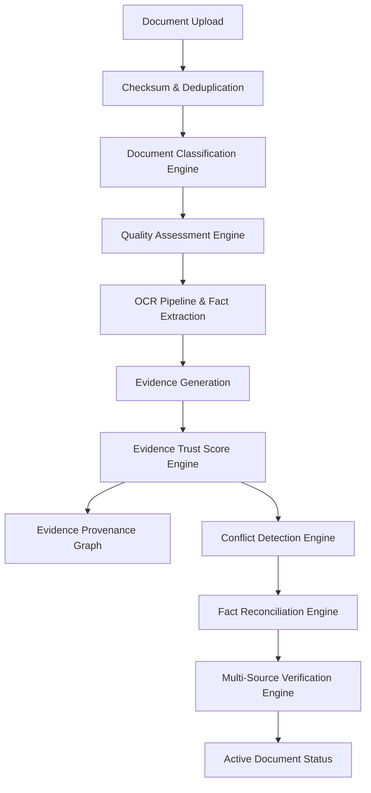

# Sprint 8 Document Intelligence & Evidence Management Platform Architecture

## System Overview
The Document Intelligence Platform provides automated, deterministic document classification, quality assessment, OCR extraction, evidence generation, trust scoring, verification, and citizen fact reconciliation.

