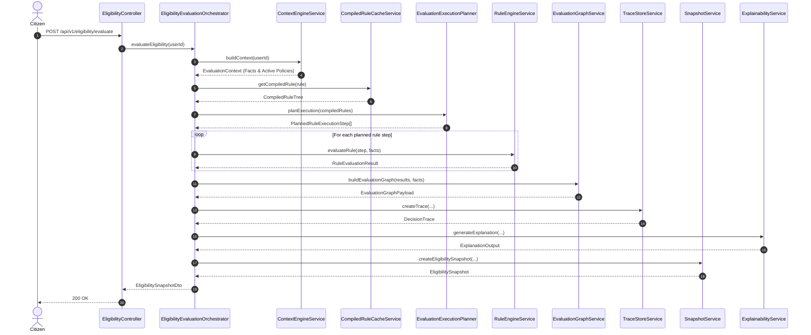

# Eligibility Evaluation Sequence Diagram

```mermaid
sequenceDiagram
    autonumber
    actor Citizen
    participant Controller as EligibilityController
    participant Orchestrator as EligibilityEvaluationOrchestrator
    participant ContextEngine as ContextEngineService
    participant Cache as CompiledRuleCacheService
    participant Planner as EvaluationExecutionPlanner
    participant RuleEngine as RuleEngineService
    participant EvalGraph as EvaluationGraphService
    participant TraceStore as TraceStoreService
    participant SnapshotService as SnapshotService
    participant Explainability as ExplainabilityService

    Citizen->>Controller: POST /api/v1/eligibility/evaluate
    Controller->>Orchestrator: evaluateEligibility(userId)
    Orchestrator->>ContextEngine: buildContext(userId)
    ContextEngine-->>Orchestrator: EvaluationContext (Facts & Active Policies)
    Orchestrator->>Cache: getCompiledRule(rule)
    Cache-->>Orchestrator: CompiledRuleTree
    Orchestrator->>Planner: planExecution(compiledRules)
    Planner-->>Orchestrator: PlannedRuleExecutionStep[]
    loop For each planned rule step
        Orchestrator->>RuleEngine: evaluateRule(step, facts)
        RuleEngine-->>Orchestrator: RuleEvaluationResult
    end
    Orchestrator->>EvalGraph: buildEvaluationGraph(results, facts)
    EvalGraph-->>Orchestrator: EvaluationGraphPayload
    Orchestrator->>TraceStore: createTrace(...)
    TraceStore-->>Orchestrator: DecisionTrace
    Orchestrator->>Explainability: generateExplanation(...)
    Explainability-->>Orchestrator: ExplanationOutput
    Orchestrator->>SnapshotService: createEligibilitySnapshot(...)
    SnapshotService-->>Orchestrator: EligibilitySnapshot
    Orchestrator-->>Controller: EligibilitySnapshotDto
    Controller-->>Citizen: 200 OK
```
