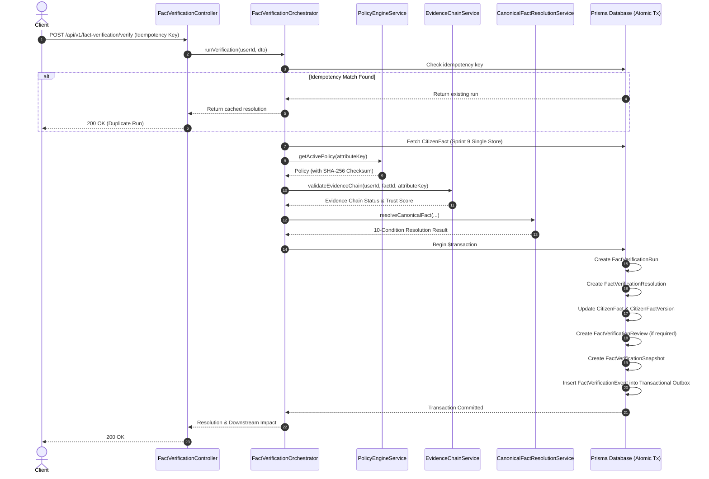

# Fact Verification Sequence Diagram

```mermaid
sequenceDiagram
    autonumber
    actor Client
    participant Controller as FactVerificationController
    participant Orchestrator as FactVerificationOrchestrator
    participant Policy as PolicyEngineService
    participant Chain as EvidenceChainService
    participant Resolution as CanonicalFactResolutionService
    participant DB as Prisma Database (Atomic Tx)

    Client->>Controller: POST /api/v1/fact-verification/verify (Idempotency Key)
    Controller->>Orchestrator: runVerification(userId, dto)
    Orchestrator->>DB: Check idempotency key
    alt Idempotency Match Found
        DB-->>Orchestrator: Return existing run
        Orchestrator-->>Controller: Return cached resolution
        Controller-->>Client: 200 OK (Duplicate Run)
    end

    Orchestrator->>DB: Fetch CitizenFact (Sprint 9 Single Store)
    Orchestrator->>Policy: getActivePolicy(attributeKey)
    Policy-->>Orchestrator: Policy (with SHA-256 Checksum)
    Orchestrator->>Chain: validateEvidenceChain(userId, factId, attributeKey)
    Chain-->>Orchestrator: Evidence Chain Status & Trust Score
    Orchestrator->>Resolution: resolveCanonicalFact(...)
    Resolution-->>Orchestrator: 10-Condition Resolution Result

    Orchestrator->>DB: Begin $transaction
    DB->>DB: Create FactVerificationRun
    DB->>DB: Create FactVerificationResolution
    DB->>DB: Update CitizenFact & CitizenFactVersion
    DB->>DB: Create FactVerificationReview (if required)
    DB->>DB: Create FactVerificationSnapshot
    DB->>DB: Insert FactVerificationEvent into Transactional Outbox
    DB-->>Orchestrator: Transaction Committed
    Orchestrator-->>Controller: Resolution & Downstream Impact
    Controller-->>Client: 200 OK
```
