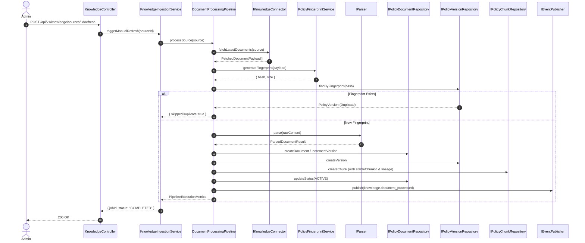

# Knowledge Acquisition Ingestion Sequence Diagram

```mermaid
sequenceDiagram
    autonumber
    actor Admin
    participant Controller as KnowledgeController
    participant IngestionService as KnowledgeIngestionService
    participant Pipeline as DocumentProcessingPipeline
    participant Connector as IKnowledgeConnector
    participant Fingerprint as PolicyFingerprintService
    participant Parser as IParser
    participant DocRepo as IPolicyDocumentRepository
    participant VersionRepo as IPolicyVersionRepository
    participant ChunkRepo as IPolicyChunkRepository
    participant EventPublisher as IEventPublisher

    Admin->>Controller: POST /api/v1/knowledge/sources/:id/refresh
    Controller->>IngestionService: triggerManualRefresh(sourceId)
    IngestionService->>Pipeline: processSource(source)
    Pipeline->>Connector: fetchLatestDocuments(source)
    Connector-->>Pipeline: FetchedDocumentPayload[]
    Pipeline->>Fingerprint: generateFingerprint(payload)
    Fingerprint-->>Pipeline: { hash, size }
    Pipeline->>VersionRepo: findByFingerprint(hash)
    alt Fingerprint Exists
        VersionRepo-->>Pipeline: PolicyVersion (Duplicate)
        Pipeline-->>IngestionService: { skippedDuplicate: true }
    else New Fingerprint
        Pipeline->>Parser: parse(rawContent)
        Parser-->>Pipeline: ParsedDocumentResult
        Pipeline->>DocRepo: createDocument / incrementVersion
        Pipeline->>VersionRepo: createVersion
        Pipeline->>ChunkRepo: createChunk (with stableChunkId & lineage)
        Pipeline->>DocRepo: updateStatus(ACTIVE)
        Pipeline->>EventPublisher: publish(knowledge.document_processed)
        Pipeline-->>IngestionService: PipelineExecutionMetrics
    end
    IngestionService-->>Controller: { jobId, status: "COMPLETED" }
    Controller-->>Admin: 200 OK
```
