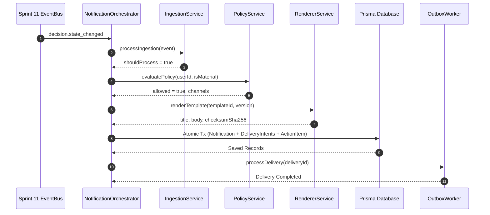

# Sequence Diagram Document

```mermaid
sequenceDiagram
    autonumber
    participant EventBus as Sprint 11 EventBus
    participant Orchestrator as NotificationOrchestrator
    participant Ingestion as IngestionService
    participant Policy as PolicyService
    participant Renderer as RendererService
    participant DB as Prisma Database
    participant Outbox as OutboxWorker

    EventBus->>Orchestrator: decision.state_changed
    Orchestrator->>Ingestion: processIngestion(event)
    Ingestion-->>Orchestrator: shouldProcess = true
    Orchestrator->>Policy: evaluatePolicy(userId, isMaterial)
    Policy-->>Orchestrator: allowed = true, channels
    Orchestrator->>Renderer: renderTemplate(templateId, version)
    Renderer-->>Orchestrator: title, body, checksumSha256
    Orchestrator->>DB: Atomic Tx (Notification + DeliveryIntents + ActionItem)
    DB-->>Orchestrator: Saved Records
    Orchestrator->>Outbox: processDelivery(deliveryId)
    Outbox-->>Orchestrator: Delivery Completed
```
