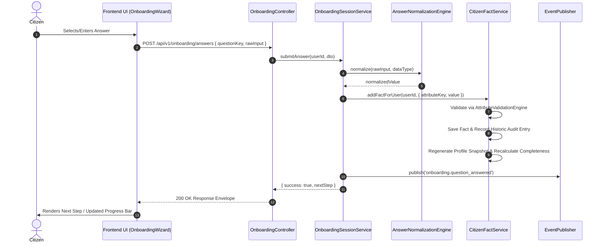

# Onboarding Discovery Sequence Diagram

```mermaid
sequenceDiagram
    autonumber
    actor Citizen
    participant UI as Frontend UI (OnboardingWizard)
    participant Ctrl as OnboardingController
    participant Service as OnboardingSessionService
    participant Norm as AnswerNormalizationEngine
    participant CitizenFact as CitizenFactService
    participant Event as EventPublisher

    Citizen->>UI: Selects/Enters Answer
    UI->>Ctrl: POST /api/v1/onboarding/answers { questionKey, rawInput }
    Ctrl->>Service: submitAnswer(userId, dto)
    Service->>Norm: normalize(rawInput, dataType)
    Norm-->>Service: normalizedValue
    Service->>CitizenFact: addFactForUser(userId, { attributeKey, value })
    CitizenFact->>CitizenFact: Validate via AttributeValidationEngine
    CitizenFact->>CitizenFact: Save Fact & Record Historic Audit Entry
    CitizenFact->>CitizenFact: Regenerate Profile Snapshot & Recalculate Completeness
    Service->>Event: publish('onboarding.question_answered')
    Service-->>Ctrl: { success: true, nextStep }
    Ctrl-->>UI: 200 OK Response Envelope
    UI->>Citizen: Renders Next Step / Updated Progress Bar
```
