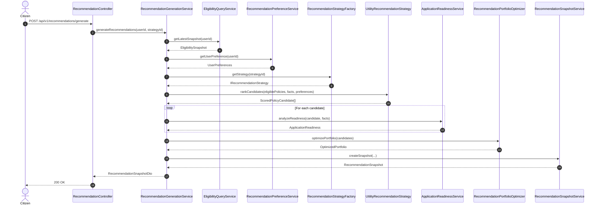

# Recommendation Generation Sequence Diagram

```mermaid
sequenceDiagram
    autonumber
    actor Citizen
    participant Controller as RecommendationController
    participant Orchestrator as RecommendationGenerationService
    participant Eligibility as EligibilityQueryService
    participant Preference as RecommendationPreferenceService
    participant Factory as RecommendationStrategyFactory
    participant Strategy as UtilityRecommendationStrategy
    participant Readiness as ApplicationReadinessService
    participant Optimizer as RecommendationPortfolioOptimizer
    participant SnapshotService as RecommendationSnapshotService

    Citizen->>Controller: POST /api/v1/recommendations/generate
    Controller->>Orchestrator: generateRecommendations(userId, strategyId)
    Orchestrator->>Eligibility: getLatestSnapshot(userId)
    Eligibility-->>Orchestrator: EligibilitySnapshot
    Orchestrator->>Preference: getUserPreference(userId)
    Preference-->>Orchestrator: UserPreferences
    Orchestrator->>Factory: getStrategy(strategyId)
    Factory-->>Orchestrator: IRecommendationStrategy
    Orchestrator->>Strategy: rankCandidates(eligiblePolicies, facts, preferences)
    Strategy-->>Orchestrator: ScoredPolicyCandidate[]
    loop For each candidate
        Orchestrator->>Readiness: analyzeReadiness(candidate, facts)
        Readiness-->>Orchestrator: ApplicationReadiness
    end
    Orchestrator->>Optimizer: optimizePortfolio(candidates)
    Optimizer-->>Orchestrator: OptimizedPortfolio
    Orchestrator->>SnapshotService: createSnapshot(...)
    SnapshotService-->>Orchestrator: RecommendationSnapshot
    Orchestrator-->>Controller: RecommendationSnapshotDto
    Controller-->>Citizen: 200 OK
```
