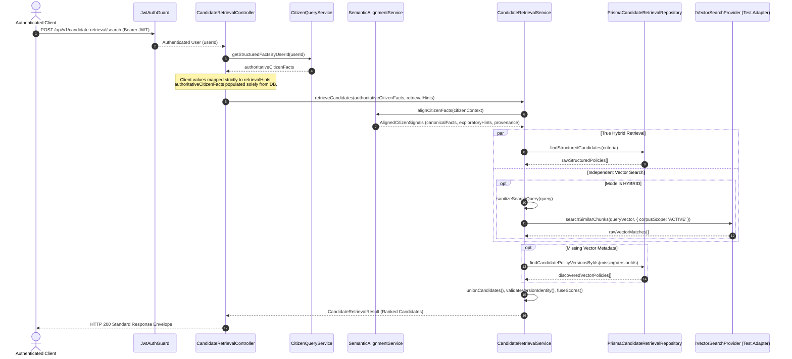
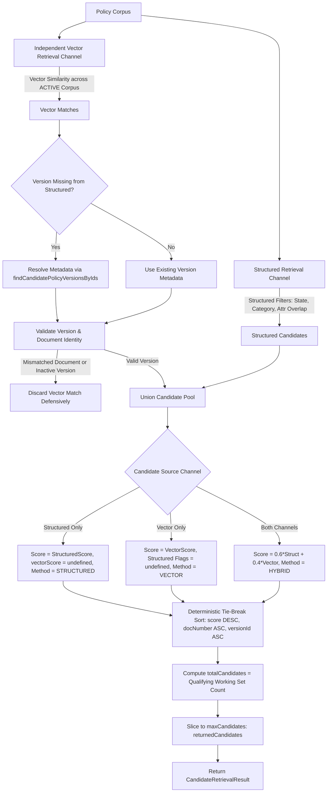

# S12B — Candidate Retrieval & Semantic Alignment Contract Specification

**Status:** RECONCILED & HARDENED (H1 + H2 Post-Remediation)  
**Version:** 1.2.0  
**Target:** S12B — Candidate Retrieval & Semantic Alignment Foundation  
**Audience:** Backend Engineers, System Architects, Security Auditors, S13 Integrators  

---

## 1. Purpose, Scope & Non-Goals

### 1.1 Purpose
Candidate Retrieval establishes a deterministic, privacy-preserving, and version-safe foundation to identify relevant policy versions (`PolicyVersion`) for a given citizen context. It sits upstream of downstream eligibility evaluation.

### 1.2 Core Mission
> **"Which policies are worth evaluating?"** — NEVER *"Is the citizen eligible?"*.

Candidate retrieval evaluates candidate relevance, domain applicability, and semantic attribute intersection. It does NOT evaluate whether a citizen meets policy rule condition thresholds.

### 1.3 Scope
1. **Ingress PII Screening**: Deterministic scrubbing of sensitive identifiers (Aadhaar, PAN, bank account, phone) from facts, hints, and search queries.
2. **Authoritative Fact Integration & Trust Boundary (H1)**: Server-side lookup of authoritative citizen facts via `CitizenQueryService`, structurally separated from caller-supplied exploratory `retrievalHints`.
3. **Semantic Alignment**: Deterministic mapping of authoritative facts and exploratory hints to the Frozen V1 Semantic Core via `SemanticRegistryService`.
4. **Structured Applicability Retrieval**: Filtering candidate policies by state, beneficiary category, policy classification, department, ministry, and semantic attribute intersection.
5. **Independent Vector Retrieval (H2)**: Independent cosine similarity retrieval across active current policy versions, enabling discovery of policies outside structured filter boundaries.
6. **Candidate Union, Deduplication & Fusion (H2)**: Deterministic mathematical weighting, deduplication by exact `PolicyVersionId`, tie-breaking, and bounded candidate selection.
7. **Version Safety & Truthful Evidence**: Explicit provenance tracking, identity validation, and truthful evidence reporting without fabricated match flags.
8. **S13 Eligibility Firewall (H1)**: Architectural firewall ensuring only authoritative citizen facts cross into S13 eligibility evaluation.

### 1.4 Non-Goals
1. **NO Eligibility Evaluation**: No threshold checks (e.g. `income <= 250000`), rule dependency evaluation, or passed/failed rule calculation.
2. **NO RuleEngine Invocation**: `RuleEngineService` is never invoked.
3. **NO Fact or Policy Mutation**: Retrieval is strictly read-only; no citizen facts or policy versions are written or altered.
4. **NO LLM/Vector Semantic Inference**: Semantic attribute resolution is 100% code-driven and deterministic via `SemanticRegistryService`.
5. **NO Production Embedding Ingestion**: Vector persistence in Postgres (`pgvector`) is scaffolded via interfaces; production pipeline is intentionally deferred (`GAP-RET-001`).
6. **NO Upstream ContextEngine Integration**: `ContextEngineService` integration is deferred to Sprint 13 (`GAP-RET-002`).
7. **NO Unbounded Database Count**: Query optimization and SQL pushdown are deferred (`GAP-RET-003`).

---

## 2. Architecture & System Boundary Diagrams

### 2.1 Retrieval Request Flow (H1 Trust Separation)


### 2.2 True Hybrid Fusion & Candidate Discovery Flow (H2)


### 2.3 S12B -> S13 Architectural Firewall (H1)
```mermaid
flowchart LR
    subgraph S12B ["Sprint 12B: Candidate Retrieval (RELEVANCE)"]
        CR_AUTH[authoritativeCitizenFacts<br/>(from DB)] --> CR_ALIGN[SemanticAlignmentService]
        CR_HINT[retrievalHints<br/>(from Caller)] --> CR_ALIGN
        CR_ALIGN --> CR_OUT[AlignedCitizenSignals]
    end

    subgraph S12B_S13_BOUNDARY ["Architectural Firewall (extractS13AuthoritativeContext)"]
        direction TB
        FW1["Passes ONLY canonicalFacts"]
        FW2["Strips ALL retrievalHints"]
        FW3["Strips ALL exploratoryHints"]
        FW4["NO Eligibility Booleans"]
        FW5["NO Passed/Failed Rules"]
    end

    subgraph S13 ["Sprint 13: Eligibility Evaluation (AUTHORITATIVE DECISION)"]
        FW_OUT[S13AuthoritativeCitizenEvaluationContext] --> EE_ORCH[EligibilityEvaluationOrchestrator]
        EE_ORCH --> RE_SVC[RuleEngineService]
    end

    CR_OUT --> S12B_S13_BOUNDARY --> FW_OUT
```

---

## 3. Data Contracts & Interfaces

### 3.1 Retrieval Modes & Statuses
```typescript
export type RetrievalMode = 'STRUCTURED_ONLY' | 'HYBRID';

export type RetrievalStatus =
  | 'SUCCESS'          // Full retrieval completed without degradation
  | 'PARTIAL_RESULTS'  // Structured retrieval succeeded; vector retrieval degraded
  | 'NO_RESULTS'       // No candidates matched retrieval constraints (retrieval only, not ineligible)
  | 'RETRIEVAL_FAILURE'; // System/DB failure prevented reliable execution
```

### 3.2 Request & Constraint Contracts (H1 Trust Separation)
```typescript
export interface CandidateRetrievalConstraints {
  state?: string;
  policyClassification?: string;
  beneficiaryCategory?: string;
  ministry?: string;
  department?: string;
  maxCandidates?: number; // 1 to 50 (default: 10)
  minScore?: number;       // 0.0 to 1.0 (default: 0.1)
}

export interface CandidateRetrievalCitizenContext {
  userId?: string;
  authoritativeCitizenFacts?: Record<string, unknown>; // Server-loaded authoritative profile
  retrievalHints?: Record<string, unknown>;            // Caller-provided exploratory hints
  facts?: Record<string, unknown>;                     // Backward-compatibility input (treated as hints)
}

export interface CandidateRetrievalRequest {
  citizenContext: CandidateRetrievalCitizenContext;
  searchQuery?: string;
  constraints?: CandidateRetrievalConstraints;
  mode?: RetrievalMode;
}
```

### 3.3 Aligned Citizen Signals (H1)
```typescript
export interface AlignedCitizenSignals {
  // Authoritative retrieval-specific typed fields
  state?: string;
  socialCategory?: string;
  ewsStatus?: boolean;
  beneficiaryCategory?: string;
  primaryOccupation?: string;
  landHoldingHectares?: number;
  annualIncomeInr?: number;
  ageYears?: number;
  gender?: string;

  // Authoritative canonical facts (solely from authoritativeCitizenFacts)
  canonicalFacts: Record<string, unknown>;
  canonicalAttributesPresent: string[];

  // Exploratory retrieval signals (derived strictly from retrievalHints; NEVER authoritative)
  exploratoryHints: Record<string, unknown>;
  exploratoryAttributeCodes: string[];
  exploratoryState?: string;
  exploratoryBeneficiaryCategory?: string;
  exploratoryPrimaryOccupation?: string;
  exploratoryAgeYears?: number;

  // Fact provenance mapping (explicitly tags each attribute as AUTHORITATIVE or EXPLORATORY_HINT)
  factProvenance: Record<string, 'AUTHORITATIVE' | 'EXPLORATORY_HINT'>;

  // Unresolved & ambiguous tracking
  unresolvedInputs: string[];
  ambiguousInputs: string[];
}
```

### 3.4 S13 Firewall Interface
```typescript
export interface S13AuthoritativeCitizenEvaluationContext {
  userId?: string;
  authoritativeCitizenFacts: Record<string, unknown>;
  canonicalFacts: Record<string, unknown>;
  canonicalAttributesPresent: string[];
}

export function extractS13AuthoritativeContext(
  request: CandidateRetrievalRequest,
  alignedSignals: AlignedCitizenSignals,
): S13AuthoritativeCitizenEvaluationContext;
```

### 3.5 Candidate Policy, Evidence & Result
```typescript
export interface CandidatePolicyProvenance {
  sourceId?: string;
  documentId: string;
  versionId: string;
  retrievedAt: string;
}

export interface RetrievalEvidence {
  stateMatch?: boolean;
  beneficiaryCategoryMatch?: boolean;
  policyClassificationMatch?: boolean;
  departmentMatch?: boolean;
  ministryMatch?: boolean;
  referencedAttributes: string[];
  vectorScore?: number;
  totalChunkCount: number;
  vectorMatchedChunkCount: number;
  uniqueMatchedChunkCount: number;
  matchedChunkCount: number; // Unique matched chunks
  sampleChunkTitles: string[];
}

export interface CandidatePolicy {
  policyId: string;
  policyVersionId: string;
  policyVersionNumber: number;
  title: string;
  documentNumber: string;
  classification: string;
  ministry?: string | null;
  department?: string | null;
  retrievalScore: number; // [0.0, 1.0] candidate relevance score (NOT eligibility confidence)
  retrievalMethod: 'STRUCTURED' | 'VECTOR' | 'HYBRID';
  matchedSignals: string[];
  matchedSemanticAttributes: string[];
  retrievalEvidence: RetrievalEvidence;
  provenance: CandidatePolicyProvenance;
}

export interface CandidateRetrievalResult {
  status: RetrievalStatus;
  candidates: CandidatePolicy[];
  returnedCandidates: number; // Count actually returned (bounded by maxCandidates)
  totalCandidates: number;    // Qualifying count in retrieval working set prior to truncation
  searchDurationMs: number;
  searchMode: RetrievalMode;
  appliedFilters: Record<string, unknown>;
  warnings?: string[];
  executionTraceId: string;
}
```

---

## 4. Operational Invariants & Policies

### 4.1 Truthful Match Indicators
Flags in `RetrievalEvidence` obey the following contract:
- If no constraint was requested: **`undefined`**.
- If constraint was requested and matched: **`true`**.
- If constraint was requested and differed: **`false`**.
- For vector-only candidates: structured flags are strictly **`undefined`** (zero fabricated match flags).

### 4.2 Working Set Semantics for totalCandidates
In accordance with `GAP-RET-003`, `totalCandidates` represents the total number of qualifying candidates discovered in the bounded retrieval working set prior to truncation, NOT an unbounded full-corpus `COUNT(*)`.

### 4.3 PII Screening Policy
Sensitive identifiers are detected via deterministic regex:
- **Aadhaar**: `\b\d{4}\s?\d{4}\s?\d{4}\b`
- **PAN**: `\b[A-Z]{5}[0-9]{4}[A-Z]{1}\b`
- **Bank Account**: `\b\d{9,18}\b`
- **Phone / Mobile**: `\b\d{10}\b`
Any match is redacted to `[REDACTED_IDENTIFIER]` and causes an audit warning. Raw PII is never logged, attached to traces, or sent to embedding providers.

### 4.4 Deterministic Ranking & Tie-Breaking
Candidates are sorted deterministically using three priority tiers:
1. `retrievalScore` descending
2. `documentNumber` ascending
3. `policyVersionId` ascending

### 4.5 Version Safety Invariant
Vector matches are fused into a candidate policy if and only if:
`vm.versionId === raw.policyVersionId && vm.documentId === raw.policyId && raw.isCurrent === true`. Any mismatch is dropped immediately.

---

## 5. Deferred Production Capabilities & Gaps

- **`GAP-RET-001`**: Production pgvector persistence and worker-based embedding ingestion. S12B implements the complete repository and provider contracts; vector persistence is deferred.
- **`GAP-RET-002`**: Upstream integration into `ContextEngineService`. S12B provides the candidate retrieval module independently; pipeline wiring is scheduled for Sprint 13.
- **`GAP-RET-003`**: Production-scale database query pushdown for rule condition JSON queries.
